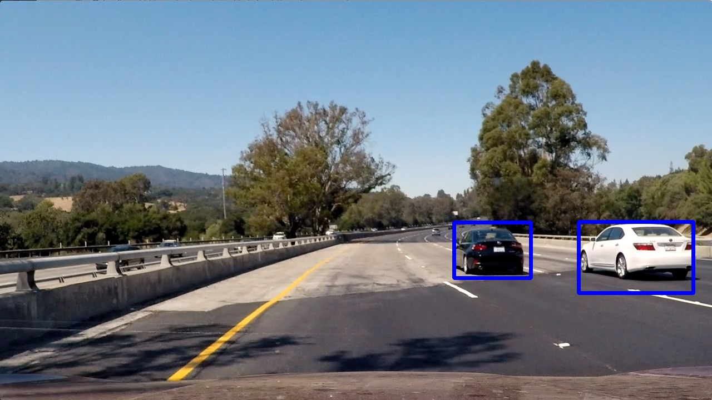

# Vehicle Detection
### Project for Udacity's Self-Driving Car Nanodegree
[](http://www.udacity.com/drive)

---

**Vehicle Detection Project**

The goals / steps of this project are the following:

* Perform feature extraction on the dataset using Histogram of Oriented Gradients (HOG), spatial binning, and histogram of colors.
* Train a linear SVM classifier on the normalized features to predict the presence of a vehicle.
* Implement a sliding-window technique and use the trained classifier to search for vehicles in images.
* Create a heatmap to cluster vehicle detections and reject false positives.
* Estimate a bounding box for vehicles.

## [Rubric](https://review.udacity.com/#!/rubrics/513/view) Points
### Here I will consider the rubric points individually and describe how I addressed each point in my implementation.

---
### Writeup / README

#### 1. Provide a Writeup / README that includes all the rubric points and how you addressed each one.  You can submit your writeup as markdown or pdf.  [Here](https://github.com/udacity/CarND-Vehicle-Detection/blob/master/writeup_template.md) is a template writeup for this project you can use as a guide and a starting point.  

All points are addressed in this README.

---

### Histogram of Oriented Gradients (HOG)

#### 1. Explain how (and identify where in your code) you extracted HOG features from the training images.


A [Histogram of Oriented Gradients (HOG)](http://scikit-image.org/docs/dev/auto_examples/features_detection/plot_hog.html) is a type of feature that can be extracted from images for training machine learning algorithms.  The image processing library *scikit-image* for Python includes a useful function `skimage.feature.hog` for generating HOG feature vectors as well as visualizations.

I included a wrapper `get_hog_features` for the skimage function (as outlined in the Udacity lessons) in the file `feature_extraction.py` (lines 7-26).  This function is used in `extract_features` (`feature_extraction.py`, lines 49-97) when initially extracting features from the labelled dataset.  The function also gets called in the functions `find_cars` and `find_cars_video` (`search_classify.py`, lines 24-101,137-211) when extracting features from test images and video frames.

The classifier was trained on stacked HOG vectors from all three channels in the YCrCb color space.  Visualizations for each HOG feature is shown below for each class.

 

 Y (Luma)

 Cr (Chroma)

 Cb (Chroma)

**Figure 1**: top: Images from each class in the dataset; below: Each color channel and its HOG visualization

#### 2. Explain how you settled on your final choice of HOG parameters.

The parameters for generating HOG features were chosen based on how they impacted the classifier accuracy on the dataset, consistency in detecting vehicles in the test images/video, and speed of the pipeline.  The following parameters were used in the final project:

```Python
color_space = 'YCrCb'
orient = 9                  # HOG orientations
pix_per_cell = 8            # HOG pixels per cell
cell_per_block = 2          # HOG cells per block
hog_channel = 'ALL'         # Can be 0, 1, 2, or 'ALL'
block_norm = 'L2'
transform_sqrt = False
```

The YCrCb color space was specifically used because it completely separates luma and chroma channels, while keeping the color space continuous.  Other color spaces--such as HLS--have discontinuities at certain hue values, creating inconsistent gradients and HOG vectors.

#### 3. Describe how (and identify where in your code) you trained a classifier using your selected HOG features (and color features if you used them).

The classifier for this project was trained using the script `train.py`.  The following steps were taken:

1. The training set is loaded from locally saved images.  The dataset was for this project was provided by Udacity, and included both vehicle and non-vehicle images.  The KITTI images were excluded because they were lower quality and lowered the accuracy of the classifier.

2. The training images for each class are shuffled, and only 5000 from each class are kept.

3. A feature vector is extracted for each image, using HOG, spacial binning, and histogram of colors.

4. Features and labels are split 80/20 between training and testing using `sklearn.model_selection.train_test_split`.

5. An SKLearn pipeline is created, consisting of `StandardScaler` followed by `LinearSVC`.  The parameters for the SVM were chosen by initially training a GridSearchCV on a reduced dataset.  PCA and ICA feature transformations were experimented with, but not included in the final version due to being computationally expensive.

6. The classifier pipeline is fit to the training data.

7. The accuracy of the classifier pipeline is calculated using the testing set.

8. The classifier pipeline is saved to `pipeline.pkl`.

---

### Sliding Window Search

#### 1. Describe how (and identify where in your code) you implemented a sliding window search.  How did you decide what scales to search and how much to overlap windows?

A sliding window search is implemented in the functions `find_cars` and `find_cars_video` (`search_classify.py`, lines 24-101,137-211).  The only difference between these functions is whether an output image is returned in addition to a list of bounding boxes.

The functions start by copying the input image and crops out portions from the top and bottom (according to an input parameter).  HOG features are computed across this entire area.  Then, for every applicable search window, the HOG features are read, and the other color features are calculated.  These are concatenated into a feature vector, and passed through the classifier to predict the label, i.e. the presence of a vehicle.

I originally tried to optimize search area and window sizes for 3 scales, but I found that using 9 scales yielded much better results and had a negligible effect on computation time.  The range of the scales vary by 3x, and the search area is adjusted accordingly.

  

  

  

**Figure 2**: Search windows for each of the 9 scales

#### 2. Show some examples of test images to demonstrate how your pipeline is working.  What did you do to optimize the performance of your classifier?

  

  

  

**Figure 3**: Search windows where the classifier predicts a vehicle for each scale

The most important optimization to the pipeline was increasing the accuracy of the classifier.  I tried several different classifiers, but the linear SVM was the most reliable.  I also performed a grid search on the SVM parameters, and used the optimal values.  It was also important to remove the KITTI images from the training set, as their quality was inconsistent with the quality of the project video.

I also optimized the performance of the test pipeline by increasing the number of scales that are searched.  This helped ensure that vehicles were always detected, and allowed the overlap to remain somewhat low.  And even though it tended to increase the number of false positives, the effect was mitigated in the video pipeline using a heatmap.

---

### Video Implementation

#### 1. Provide a link to your final video output.  Your pipeline should perform reasonably well on the entire project video (somewhat wobbly or unstable bounding boxes are ok as long as you are identifying the vehicles most of the time with minimal false positives.)
Here's a [link to my video result](./project_video_output.mp4)


#### 2. Describe how (and identify where in your code) you implemented some kind of filter for false positives and some method for combining overlapping bounding boxes.

The entire video pipeline is located in the file `video.py`.

A heatmap is used to represent areas in the image where a vehicle is detected.  Every prediction from the sliding window search increments the corresponding pixels in the heatmap by 1. After every scale has been searched, a Gaussian blur is applied to the heatmap with a kernel size of 7x7.  At this point, `scipy.ndimage.measurements.label` is used to generate bounding boxes from the heatmap, only considering pixels with an intensity greater than 4.

The heatmap is persistent in the video pipeline, and 50% of the intensity values are carried over into the next frame.  The persistence of the heatmap and the Gaussian blur help make the bounding boxes more consistent between frames and less jittery.  The heatmap also reduces false positives by requiring the intensity be greater than a threshold before creating a bounding box.  This is effective because the false positives from the classifier do not appear with the same frequency across scales or frames as valid vehicle detections.

 

 

 

**Figure 4**: Bounding boxes created from heatmaps for each test image

---

### Discussion

#### 1. Briefly discuss any problems / issues you faced in your implementation of this project.  Where will your pipeline likely fail?  What could you do to make it more robust?

The main issue when testing the pipeline was finding a suitable threshold and rollover percent for the heatmap.  These values complement each other and are needed prevent false positives.  In order to limit the false positive, I used fairly strict values, which required a high accuracy from the classifier.  I also faced a bug during development where the heatmap would get cleared after every frame, but I solved this by moving the `global` keyword inside the function.

Currently, the pipeline could be improved by adjusting the search area in the sliding window search to extend completely to the right edge of the image.  Figure 2 shows this issue in the current implementation.  Increasing the overlap in the search windows might also help create a tighter bounding box around the images by creating more accurate heatmaps.

The placement of bounding boxes could also be improved by altering how labels are assigned; it should be possible for nearby cars to have overlapping boxes, rather than merging their boxes together.  It may be worth altering the parameters to `scipy.ndimage.measurements.label` or  tracking the centroid of the box between frames to solve this issue.
